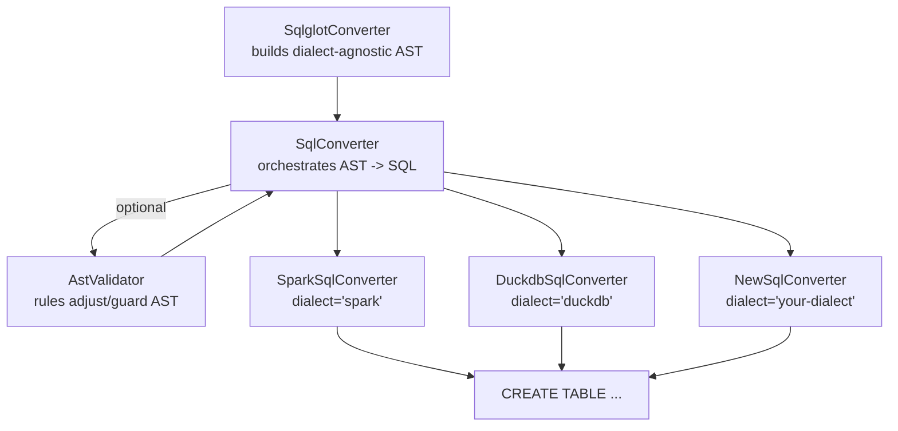

# SQL Converters

Conversion from a `yads` spec to SQL starts with a neutral neutral [AST](https://en.wikipedia.org/wiki/Abstract_syntax_tree) representation that is handled by [`sqlglot`](https://sqlglot.com/sqlglot.html) via the [SqlglotConverter](sqlglot.md).

A `SqlConverter` can then be used to convert this intermediary AST into a dialect-specific SQL DDL statement, while optionally handing the resulting tree to an `AstValidator` before rendering SQL to the target dialect.

The following flowchart illustrates the process:



Any `sqlglot` dialect string can be passed to `SqlConverter`, but for consistent guarantees, use one of the [Dedicated SQL Converters](#dedicated-sql-converters) that come with built-in dialect validations.

## SQL Converter

Use `SqlConverter` directly when you want to target arbitrary `sqlglot` dialects or supply your own AST validator stack. The example below loads a spec from disk and renders PostgreSQL DDL, but the only required change for other platforms is the `dialect` name in `SqlConverterConfig`.

<!-- BEGIN:example sql-converter-basic sql-converter-code -->
```python
import yads
from yads.converters.sql import SqlConverter, SqlConverterConfig

spec = yads.from_yaml("docs/src/specs/submissions.yaml")

converter = SqlConverter(
    SqlConverterConfig(
        dialect="postgres",
    )
)
ddl = converter.convert(spec, pretty=True)
print(ddl)
```
<!-- END:example sql-converter-basic sql-converter-code -->
<!-- BEGIN:example sql-converter-basic sql-converter-output -->
```text
CREATE TABLE prod.assessments.submissions (
  submission_id BIGINT PRIMARY KEY NOT NULL,
  completion_percent DECIMAL(5, 2) DEFAULT 0.0,
  time_taken_seconds INT,
  submitted_at TIMESTAMPTZ
)
```
<!-- END:example sql-converter-basic sql-converter-output -->
!!! info
    Install one of the supported versions of sqlglot to use this converter with `uv add 'yads[sql]'`

::: yads.converters.sql.sql_converter.SqlConverter

::: yads.converters.sql.sql_converter.SqlConverterConfig

## Dedicated SQL Converters

Dedicated SQL Converters subclass `SqlConverter` with pre-loaded validator rules, AST settings, and default dialects. They are the fastest path when you want officially supported DDL for those runtimes without tuning configs yourself.

<!-- BEGIN:example sql-converter-basic spark-converter-code -->
```python
import yads
from yads.converters.sql import SparkSqlConverter

spec = yads.from_yaml("docs/src/specs/submissions.yaml")

ddl = SparkSqlConverter().convert(spec, pretty=True)
print(ddl)
```
<!-- END:example sql-converter-basic spark-converter-code -->
<!-- BEGIN:example sql-converter-basic spark-converter-output -->
```text
CREATE TABLE prod.assessments.submissions (
  submission_id BIGINT PRIMARY KEY NOT NULL,
  completion_percent DECIMAL(5, 2) DEFAULT 0.0,
  time_taken_seconds INT,
  submitted_at TIMESTAMP
)
```
<!-- END:example sql-converter-basic spark-converter-output -->

::: yads.converters.sql.sql_converter.SparkSqlConverter

::: yads.converters.sql.sql_converter.DuckdbSqlConverter
